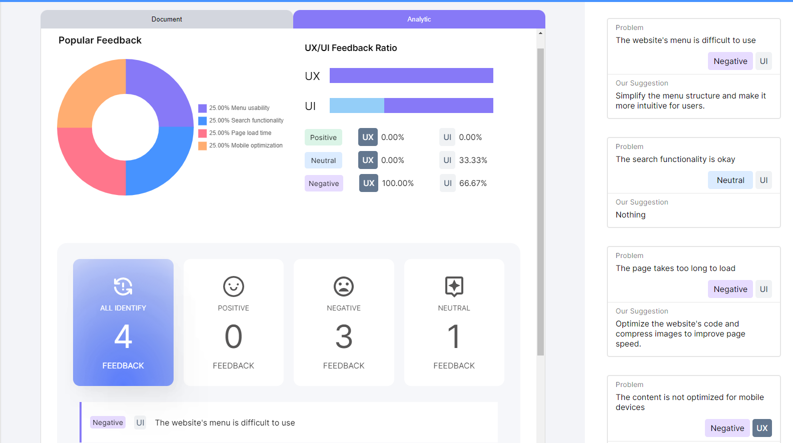

# IFFS

IFFS is a web-based application designed to streamline the process of collecting and analyzing customer feedback. Our solution aims to help website owners easily see the critical level of the problems reported by their users, prioritize which problems should be fixed first, and monitor the overall feedback trend on their website pages. Our system categorizes feedback into three categories: positive, negative, and neutral, providing an in-depth analysis of user satisfaction levels. With IFFS, website owners can make informed decisions to improve their website and enhance the user experience.

## Features

- Streamlined feedback collection: IFFS makes it easy for website owners to collect feedback from various sources, including chatbots, contact forms, and surveys.
- Real-time feedback analysis: IFFS categorizes feedback into positive, negative, and neutral, allowing website owners to quickly see the critical level of the problems reported by their users.
- Prioritization of critical problems: IFFS uses machine learning algorithms to prioritize which problems should be fixed first, based on factors such as the severity and frequency of the problem.
- Trend analysis: IFFS provides website owners with an overall feedback trend analysis, allowing them to monitor changes in user satisfaction levels over time.
- Customizable dashboard: IFFS offers a customizable dashboard that allows website owners to choose which metrics to display and track.

## Demo

To see IFFS in action, try entering feedback into our demo at https://iffs.vercel.app/. You can enter any feedback you like, and our system will categorize it and provide an in-depth analysis of user satisfaction levels.

Input

`The website's menu is difficult to use and the search functionality is unreliable. The page takes too long to load and the content is not optimized for mobile devices.`

Output

## Deployment

We hosted website on Vercel, and hosted a database on firestore

## Setup your own deployment

### Self-hosted

1. Clone the project from github and open working repository
2. Open terminal run `npm install`
3. In terminal run `mv .env.example .env.local` (this will copy `.env.example` and write new file name `.env.local`)
4. Config file `.env.local` with your own keys
5. Run the app in terminal with `npm start`

### Cloud-hosted

This could be vary depends on the cloud server you use, but the key word is `Setup NextJs with ......` and you can see what environtment variables you need to config in `.env.example` file

## Tech Stack

**Client:** NextJs, ReactQuery, SaSS

**Server:** NextJs, Firestore

**Others:** OpenAI

## Authors

- [@ThisGameZR](https://www.github.com/ThisGameZR)
- [@OhiyuiiDesu](ohiyuiidesu@gmail.com)

### We hope that IFFS will help website owners improve their websites and enhance the user experience. Thank you for considering our solution!
